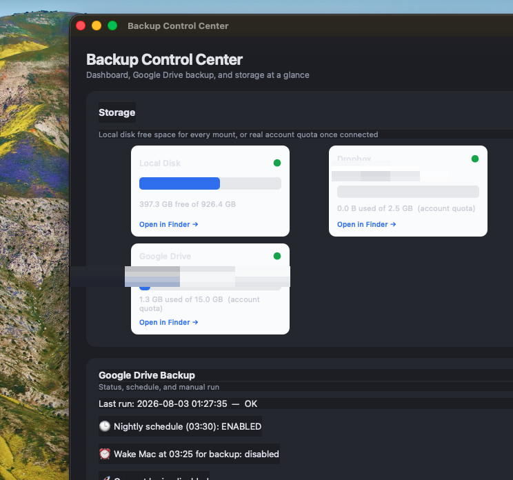

# Backup Control Center



A PySide6 desktop app to monitor cloud storage and manage the custom Google Drive
backup (the rsync job in `_Admin/backup/`).

## What it does

Single-screen, scrollable dashboard with five cards plus a menu-bar icon.

### Storage
Local Disk, Google Drive, and Dropbox tiles — each with a fill progress bar (turns
amber at 70 %, red at 90 %) and real account quota once connected via OAuth. Unmounted
drives are hidden automatically. Duplicate CloudStorage folders for the same account are
deduplicated. Storage tiles auto-refresh every 5 minutes.

- **☁ Cloud accounts…** — paste a one-time OAuth Client ID/Secret (Google) or App
  Key/Secret (Dropbox), then Connect each mount to show its real used/total quota.
  Expired tokens show a red "Token expired — reconnect →" link.
- **+ Add account** — monitor a Google Drive / Dropbox account's quota even without a
  local mount.
- Proton Drive and iCloud Drive are intentionally excluded — neither provider publishes
  a public quota API (see "What it deliberately does NOT do").

### Google Drive Backup
Last run timestamp and status (OK / WITH ERRORS), live log output, and:

| Control | Effect |
|---|---|
| **▶ Run backup now** | Starts the rsync backup immediately |
| **⚟ Dry run** | Previews what rsync would copy — no files changed. Writes to `dryrun_*.log` so it never confuses the auto-backup detector |
| **📋 History** | Table of the last 15 backup runs: date, start time, duration, colour-coded status |
| **■ Stop** | Kills the running backup or dry run |

Three toggles below the buttons:

| Toggle | Effect |
|---|---|
| **🕒 Nightly schedule (03:30)** | Enables the in-app auto-backup timer (see "How the nightly backup works") |
| **⏰ Wake Mac at 03:25** | Sets a `pmset` wake schedule so the Mac powers on before 03:30 |
| **🚀 Open at login** | Adds or removes the app as a macOS Login Item — the recommended way to keep it running overnight |

**Notifications:** a macOS notification fires when a real backup finishes (success or
errors). If the last successful backup is more than 25 hours ago, a warning notification
fires at each 5-minute poll tick.

### Backed-up Folders
Add or remove folders from the rsync job (confirmation required before removal), edit
rsync exclude patterns, and see the total local size of the backup set.

### Lab Health
A table of every project in `lab/active/`, rescanned on demand: total size, reclaimable
space (`.venv`, `build`, `dist`, `__pycache__` and the other names in
`gdrive_backup_excludes.txt` — already git-ignored and backup-excluded, so safe to
delete), git status (clean / N uncommitted / no repo), and a warning if a project is
missing `requirements.txt`/`pyproject.toml` or has an `.env` that isn't git-ignored.
**🧹 Clean up checked** deletes the reclaimable folders for checked rows after a
confirmation dialog listing exactly what will go and how much space it frees;
**🔄 Rescan** refreshes the table (also runs on **Refresh all** and at launch).
Rebuild a cleaned venv with `uv sync` or `pip install -r requirements.txt`.

### Tools & Links
Quick launchers and helpers in a grid:

- **Open locations** — backup destination, logs directory, CloudStorage, iCloud Drive,
  Time Machine settings.
- **Documentation** — in-app viewer for README, Backup Strategy, Google Drive Setup,
  Proton Vault Guide, and Lab Overview.
- **Account pages** — Google One, Dropbox, Proton, iCloud storage pages.
- **Tools** — Google Photos Takeout guide (step-by-step download + Photos import),
  Proton vault mount check, and Time Machine: back up now.

### Menu-bar icon
A status item in the macOS menu bar shows the last backup timestamp in its tooltip.
Right-click for **Show**, **Run Backup Now**, and **Quit** — no need to open the full
window to check status or trigger a run.

### Dark mode
Automatically matches the system light/dark appearance at launch.

---

## What it deliberately does NOT do
- It does not reconfigure the proprietary sync engines of iCloud, Google Drive, Dropbox,
  or Proton Drive — those stay in their own apps. It has full control only over the rsync
  backup layer we built.
- **iCloud Drive and Proton Drive will never show real cloud quota.** Apple and Proton
  publish no public API for storage quota. This is a permanent provider limitation, not a
  missing setup step. (Google Drive and Dropbox both publish official REST quota APIs,
  which is what **Cloud accounts…** uses.)

---

## How the nightly backup works

The backup is triggered by an in-app timer, **not** by launchd launching the app. This
is required because macOS 26 (Tahoe) removed `spctl --add` and Gatekeeper blocks unsigned
apps from being launched by launchd in non-interactive contexts.

**Flow:**
1. App runs a 5-minute polling timer.
2. On each tick (and 10 s after launch): if the nightly schedule is enabled, it is past
   03:30, and no backup has started today at or after 03:30 — the backup fires.
3. The backup runs under the app's Full Disk Access grant; rsync reads all folders
   without extra setup.

**The app must be running for the auto-backup to fire.** Use the **🚀 Open at login**
toggle in the Backup card to register it as a Login Item — this is the recommended setup.
The app uses no CPU while idle.

The launchd job (`com.andreas.gdrive-backup`) remains installed as a best-effort
fallback for the day Apple re-allows launching unsigned apps from agents, but the
reliable path on macOS 26 is the in-app timer.

---

## Single-instance guard
Opening a second GUI instance shows a native alert ("Backup Control Center is already
open") and brings the existing window to front. The guard does not affect the
`--run-backup` headless mode used by the launchd fallback.

---

## Credentials
OAuth tokens and app credentials are stored in:
```
~/Library/Application Support/Backup Control Center/
```
This location survives `.app` rebuilds. Nothing is stored inside the bundle.

---

## Full Disk Access
The app needs Full Disk Access so rsync can read all your Documents subfolders.

Grant it once:
> System Settings → Privacy & Security → Full Disk Access → **+** →
> select `/Applications/Backup Control Center.app`

**After each rebuild** the ad-hoc code signature changes, so FDA must be re-granted:
remove the old entry and add the freshly built app. The app will warn you if it cannot
reach the backup destination.

---

## Run from source
```bash
cd ~/Documents/lab/active/backup_manager
uv venv .venv && uv pip install -r requirements.txt
source .venv/bin/activate
python main.py
```

## Build as a standalone app
```bash
cd ~/Documents/lab/active/backup_manager
./build_app.sh
```
Builds `Backup Control Center.app` with PyInstaller and installs it into `/Applications`.
Re-run after any change to `main.py` or `cloud_quota.py`, then re-grant Full Disk Access.

---

## Config files read/written
| File | Purpose |
|---|---|
| `_Admin/backup/backup_folders.txt` | Which folders are backed up |
| `_Admin/backup/gdrive_backup_excludes.txt` | rsync exclude patterns |
| `_Admin/backup/backup_to_gdrive.sh` | The backup script (set `DRY_RUN=1` for a preview) |
| `_Admin/backup/com.andreas.gdrive-backup.plist` | launchd fallback job |
| `_Admin/backup/logs/backup_YYYY-MM-DD.log` | Dated run logs |
| `_Admin/backup/logs/dryrun_*.log` | Dry-run output (not picked up by backup detection) |

---

## Backlog
- Proper Developer ID code signing — removes the need to re-grant FDA after each rebuild
  and would allow launchd to launch the app directly as a reliable fallback.
